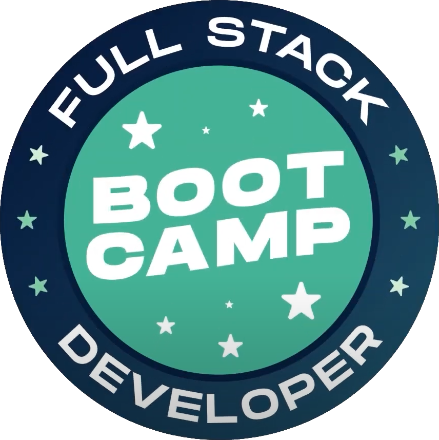

# Bootcamp - Desenvolvedor Full-Stack
 

## Sobre o repositório

Projetos práticos desenvolvidos durante o bootcamp de desenvolvedor Full Stack do [IGTI](https://www.igti.com.br/).

# Desenvolvedor Full-Stack

## Objetivo principal: 
Obter uma formação prática e intensiva habilitando-se para atuar como desenvolvedor Full Stack.

## Objetivos específicos:
Conhecer técnicas de construção de uma aplicação passando 
por todas as suas camadas lógicas - backend, frontend, 
persistência de dados NoSQL, controle de versionamento 
de código com Git e implantação em nuvem - habilitando-se 
para atuar profissionalmente na área

# Módulos

## Fundamentos
- Introdução, instalação e configuração do Visual Studio Code (VSCode). 
- Instalação do Node.js. 
- Instalação da biblioteca live-server. 
- Noções de HTML e CSS. 
- Introdução ao JavaScript. 
- Integração do JavaScript com o HTML e CSS. 
- JavaScript básico:
  - console; 
  - comentários;
  - tipos primitivos;
  - variáveis;
  - API’s nativas de servidor e web;
  - funções;
  - estruturas de decisão;
  - estruturas de repetição;
  - manipulação de eventos.
  
## Desenvolvimento de API's
- Introdução ao desenvolvimento backend. 
- Backend x frontend. 
- Introdução ao desenvolvimento de APIs. 
- Introdução ao desenvolvimento com Node.js. 
- Introdução ao Express. 
- Criação de requisições HTTP, rotas e middlewares com Express. 
- Introdução à ferramenta Insomnia. 
- Construção de APIs HTTP, utilizando as principais operações: 
  - GET;
  - POST; 
  - PUT;
  - DELETE. 
- Desenvolvimento das operações CRUD.
- Persistência de Dados em Arquivos.

## FrontEnd com React
- Instalação e configuração do React.
- Criação de projetos com o create-react-app.
- Introdução ao React:
  - JSX, 
  - Componentes de Funções;
  - Componentes de Classe;
  - State;
  - Props;
  - Binding;
  - Interpolação. 
- Comunicação entre componentes.
- Ciclo de vida de componentes de classe. 
- Introdução às requisições HTTP com React.
- Roteamento com react-router.
- Introdução ao Ionic React.
- Criação de um pequeno projeto com React.

## Persistência de dados, versionamento de código e implantação
- Introdução ao MongoDB.
- Utilização do serviço mLab.
- Integrando a API ao MongoDB no mLab.
- Introdução ao Git. 
- Instalação do git. 
- Principais comandos do Git. 
- Como publicar aplicações no Github.
- Introdução ao Heroku. 
- Instalação do Heroku CLI. 
- Como implantar aplicações no Heroku.

## Desafio Final
- Entrega da aplicação final.

# Projetos
## Trabalhos práticos
Aplicações desenvolvidas na metade do módulo para colocar em prática os conhecimentos adiquiridos.

- [Trabalho Prático do Módulo 1](https://github.com/rafa-guimaraes/bootcamp-full-stack/tree/master/trabalhos-praticos/trabalho-pratico-1) - Números por extenso
- [Trabalho Prático do Módulo 2](https://github.com/rafa-guimaraes/bootcamp-full-stack/tree/master/trabalhos-praticos/trabalho-pratico-2) - Cidades e Estados do Brasil

## Desafios
Aplicações desenvolvidas ao final do módulo para colocar em prática os conhecimentos adiquiridos.

- [Desafio do Módulo 1](https://github.com/rafa-guimaraes/bootcamp-full-stack/tree/master/desafios/desafio-1) - Pesquisa de usuários
- [Desafio do Módulo 2](https://github.com/rafa-guimaraes/bootcamp-full-stack/tree/master/desafios/desafio-2) - API para controle de grades

## Outros desafios
Aplicações desenvolvidas durante as aulas do módulo

- [CRUD](https://github.com/rafa-guimaraes/bootcamp-full-stack/tree/master/outros-desafios/crud) - CRUD simples utilizando html, css e js
- [Lista de países](https://github.com/rafa-guimaraes/bootcamp-full-stack/tree/master/outros-desafios/lista-paises) - lista de países recebida de uma api
- [Brasileirão](https://github.com/rafa-guimaraes/bootcamp-full-stack/tree/master/outros-desafios/brasileirao) - Mostra no console o campeão do campeonato brasileiro de acordo com os resultados das partidas
